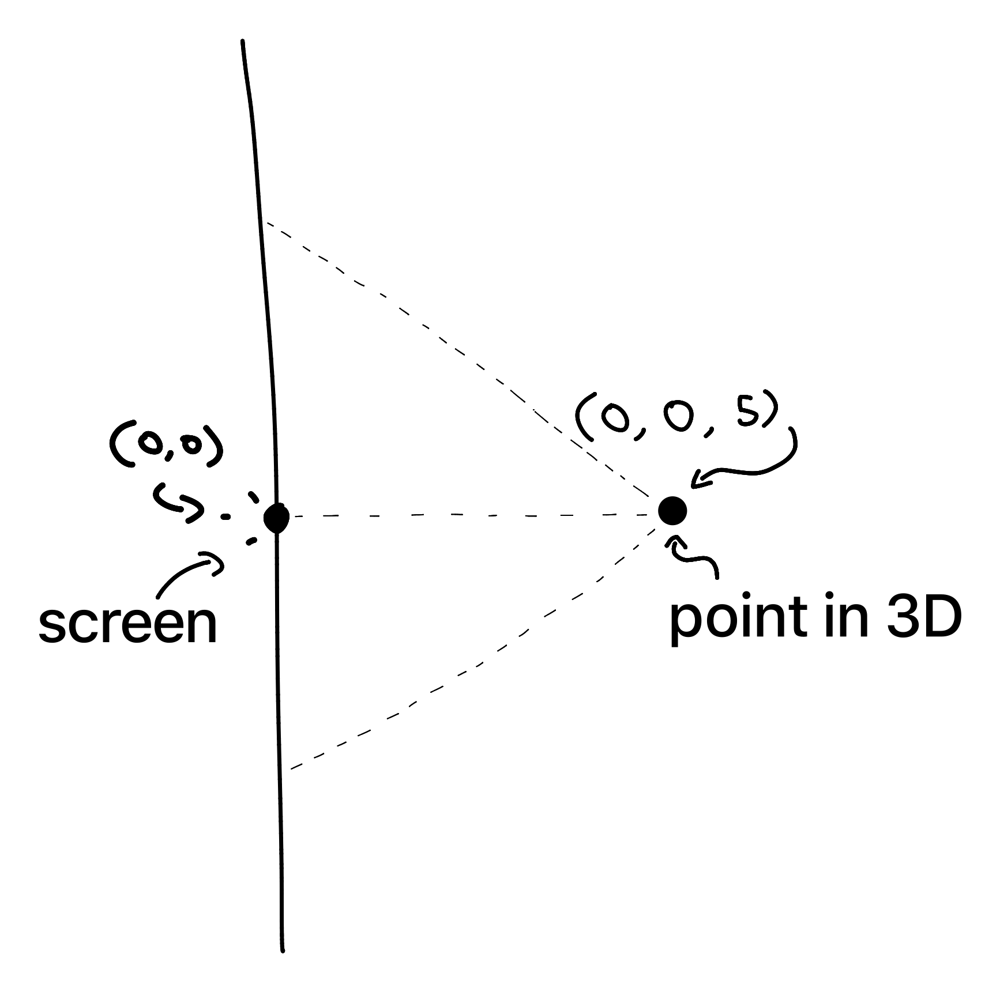
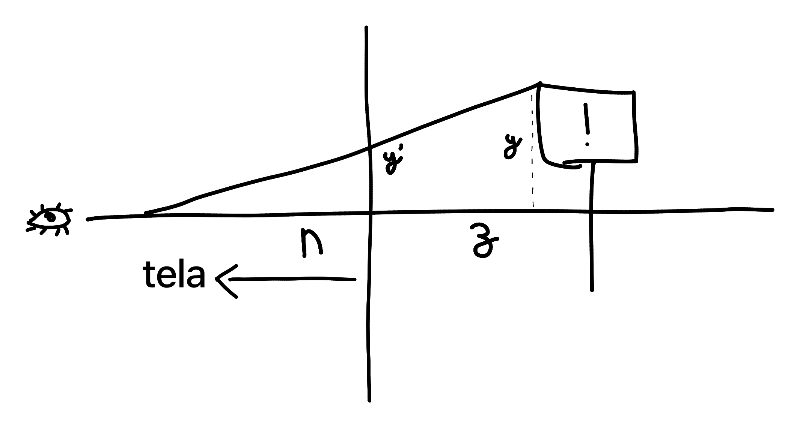
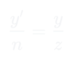

# Pontos 3D em 2D
## Diferenças de espaço
O espaço de um display é apenas 2D, ou seja, vive no espaço definido em $(x, y)$, enquanto o espaço 3D é regido pelo espaço $(x,y,z)$.

Na conversão de espaços, precisamos normalizar ambos espaços definidos com seus pontos de origem $O$ definidos em $(0,0)$. Ambos espaços devem ser limitados lateralmente por $(-1,1)$ da direita para esquerda respectivamente e de baixo para cima respectivamente. Na imagem acima, estamos visualizando lateralmente a projeção sendo feita no plano $y'$.

Precisamos aplicar uma transformação na visão da tela pra dar a sensação de profundidade do espaço 3D num plano 2D. Para isso, temos como regra que dois objetos, tanto na tela, quanto no espaço, **são proporcionais.**

Ajustando essa igualdade, temos que:

Entretanto, nessa aplicação eu preciso apenas transformar pontos 3D em pontos 2D, sem me preocupar com renderizar curvas de bezier ou coisas do tipo, então eu posso projetar o plano _display_ no plano _espacial_ sem levar em consideração matrizes de rotação e translação. Assim, simplifico esse projeto que demoraria semanas pra completar e eu nem tocaria nele durante anos...

Com a imagem acima fica mais simples de entender, simplesmente convertemos o espaço para o plano ignorando o eixo (neste caso) $z$, e o modo que fazemos isso é simples:
- Olhando para a tela de cima, você tem $x$ e $z$
- Olhando de lado, $y$ e $z$
Calculando a distancia focal de cima e dos lados, achamos a diferença entre o olho (da imagem) e o meio da tela $(0,0)$, criando um triangulo retângulo. Tendo a distancia do olho até a tela como $ds_{w}$

Tendo nossa distância do olho pra tela como $1$ (normalizando ambos os espaços), podemos simplificar para:

Sabendo que $x',x$ estão limitados por $-1,1$ e $y',y$ por $-1,1$. Agora podemos simplesmente transformar entre ambos espaços, projeção é simplificadamente basicamente só isso.

